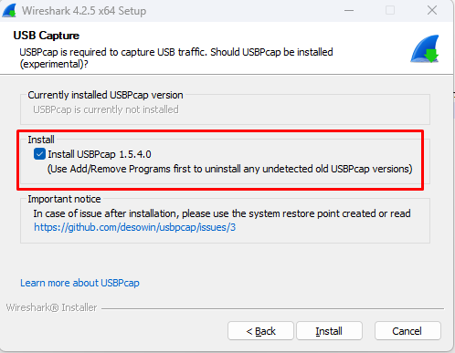

# Wireshark capture

## Introduction
This document introduce how to do a wireshark capture in order to debug deep issues

## Download wireshark

https://www.wireshark.org/download.html
Usually you have to install "Windows x64 Installer"

## Install wireshark

This steps is important, you will have to install wireshark with "USBPcap"
Start wireshark installation (Next, Next ...)
When you meet this screen:

You have to check Install USBPcap, then continue the installation

## Capture
This chapter describe how to capture USB traffic with wireshark

### How to start a capture

### How to stop a capture

### How to find the correct USBPcap
You problay see multiple USBPcap when you try to start a capture, you might have USBPcap1, USBPcap2, USBPcap3, USBPcap4 ...
It corresponds to the USB host controller present on your system, so it depends to your system.
We will have to find the correct USB host controller (Where is plug your controller)

1. Start a capture on one USBPcap (USBPcap1, USBPcap2, ...)
2. Wait without using any USB device (Mouse, Keyboard, ...)
Here you will have 2 behaviours, either nothing will move, or you will have a constant flow of data.
3. Now plug your controller
  If you see new data comming (acceleration of logs for example), You found the correct USBPcap. 
  If you notice no changes, It means you selected the incorrect USBPcap. Re-execute these steps with the next USBPcap.

### Procedure to have a clean capture
Once you found the correct USBPcap (Refer you to above steps), we can start a clean capture.
In order to capture with wireshark the boot sequence, you need to first unplug your USB device
During the wireshark capture, try not using your other USB devices (Mouse, Keyboard, Audio etc...) - It will simplify the investigation for the maintainer.

Steps:
 - Start the capture on the correct USBPcap
 - Plug the USB controller
 - Wait 1s or 2s
 - Then press/release 1 button multiple time (This will help maintainer to find your controller)
 - Stop the capture
 - Save it (File -> Save As).